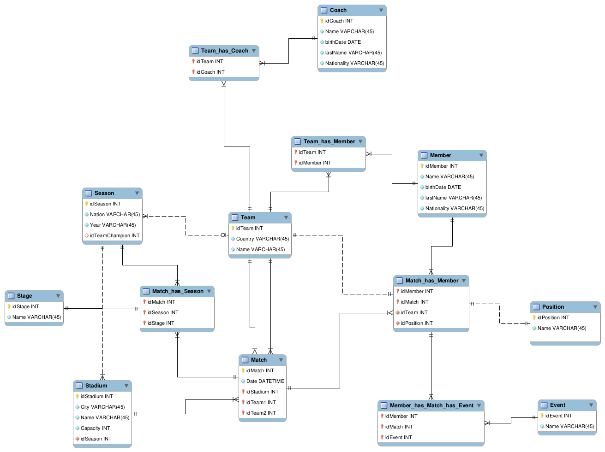
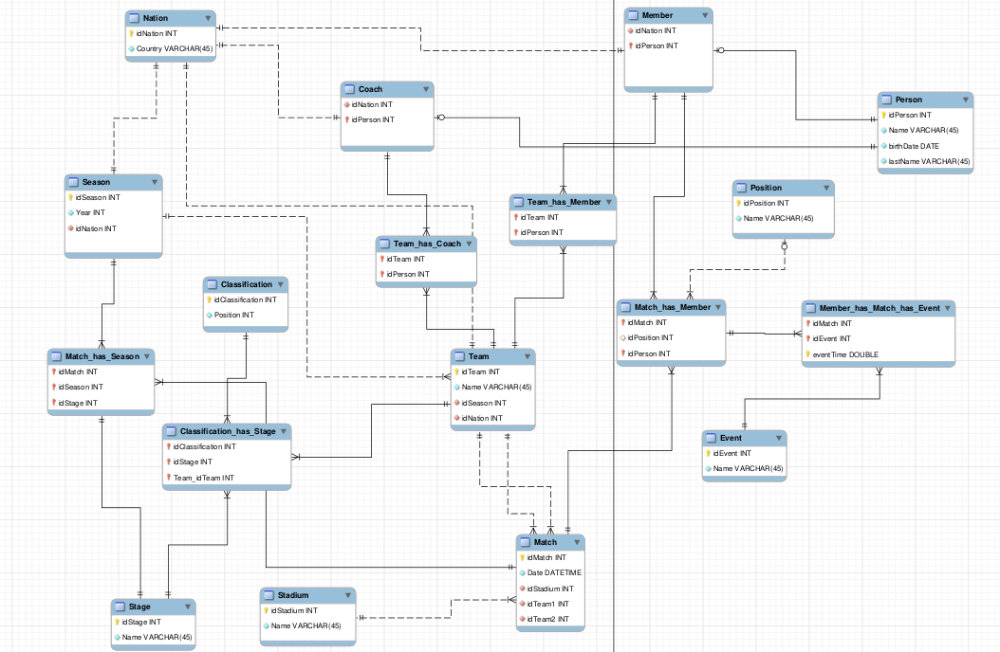

<h1 align='center'>Projeto Prático - World CUP  </h1>

Projeto de desenvolvimento de um database para um cenário de armazenamento de dados sobre edições de Copa do mundo de futebol

Tabela de conteúdos
=================
<!--ts-->
   * [Objetivos](#Objetivos)
   * [Modelagem](#Modelagem)
   * [Observação](#Observação)
   * [Autores](#Autor)
<!--te-->

# Objetivos
Sobre o evento “Copa do mundo de futebol”, desenvolver uma modelagem do banco de dados necessário para o sistema de informação que essa empresa precisa usando a ferramenta MySQL Workbench.

Uso da JPA(Java Persistence API) para casos de um-para-um , um-para-muitos, uso com um banco de dados existentes. O uso desta API juntamente com o biblioteca Lombok foi combina-los para realizar o projeto do world cul futbol data base. A API juntamente com lombok gera facilitação quando se deseja projetar um banco de dados a partir de um modelo ER que neste caso foi feito pelo Mysql WorkBench ferramente para modelagem de banco de dados.

# Modelagem

A modelagem foi feita a partir de que uma temporada onde times de países diferentes foram classificados farão parte da “Copa do mundo de futebol” e cada time possui membros em que cada um tem sua posição por meio de partida e que cada time pode possuir diferentes técnicos em distantes temporadas. As partidas irão ocorrer em estádios de diferentes cidades da nação divididas por fases irão acontecer por temporada com data e hora marcada,sendo que nessas partida dois times irão jogar e que os membros irão realizar eventos durante essa partida que será registrado.

</img>

- Correção

A medida que foi se montando o banco foi possível analisar repetições de dados em mesma tabela como no caso de coach e member e atributo de nationality, então foi reestruturado para uma nova modelagem por meio da terceira forma normal. O mesmo caso ocorreu para atributos repetidos de coach e member porém houve problemas de implementação para generelização de ambas com a biblioteca lombok e JPA.

</img>

# Observação

Ao longo que se modelou o projeto foi feito diversas modificações para modelagem final o que impactou na estrutra do projeto e reescrita do código pois como a quantidade de dados a serem inseridos é muito, não foi possível finalizar o projeto. A falta de prática com API de JPA pode ter impactado em decisões de remodelagem, achando que facilitaria em termos de código porém causaram problemas de difícil detecção. Uso da framework facilitou muito em termos de código limpo e construtores e acessibilidade as classes implementadas. Quando ao uso do Mysql Workbench para modelagem ER foi descoberto que as vezes ele da crash e então é sempre bom estar salvando constantemente se não irá perder suas inserções feitas manualmente de dados ou reestruturação de remodelagem.

Foi possível botar em prática o aprendizado do semestre em relação a identificação de modelagem de um cenário de aplicação para um banco de dados seus atributos,entidades,relacionamentos, o quanto de informação cada entidade deve possuir com uso prático das primeira segunda e terceira forma normal para correção de repetição de dados e que um banco de dados sempre pode ser remodelado para melhor desempenho. Não foi possível botar em prática total o tipo de ensinamento que tivemos sobre Objeto de acesso a dados (acrônimo do inglês Data Access Object - DAO) um padrão para aplicações que utilizam persistência de dados para a separação das regras de negócio das regras de acesso a banco de dados. Foi utilizada a JPA para construção do projeto e se notou que é muito prático e facilitador porém é necessário prática para poder aperfeiçoar a construção completa quando se trata de implementação de um projeto de banco de dados.

# Autor

<a href="https://github.com/jeffersonbcr">
     
    <b>Jefferson Botitano</b></a>
